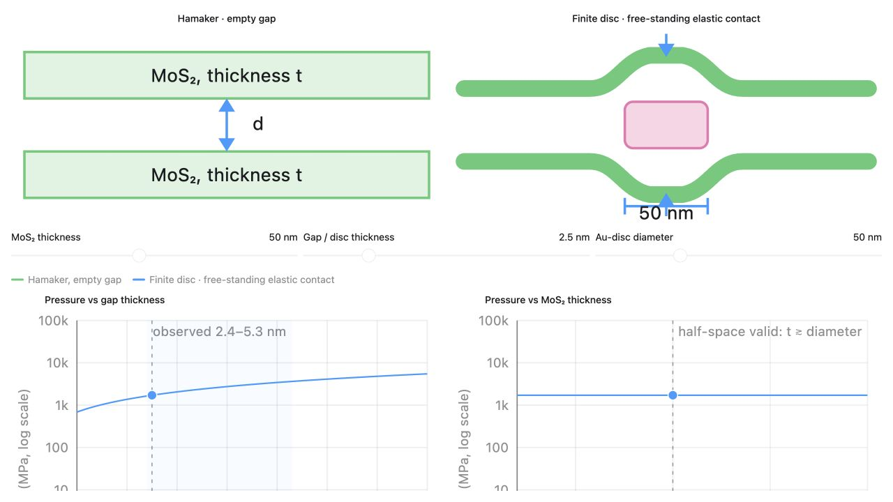

# MoS2-MoS2 confinement pressure analysis

[**Launch the interactive confinement-pressure explorer →**](https://cuiyist.github.io/MoS2-Au-MoS2/)

This directory contains a reproducible estimate of the normal-pressure scales relevant to an Au nanodisc confined between two MoS₂ flakes during annealing. The calculation uses the experimentally relevant **50 nm mean Au-disc diameter**, approximately **50 nm MoS₂ thickness per flake**, and a **2.4–5.3 nm disc/gap thickness**.

The two plotted models answer different physical questions and should not be added together:

1. **Finite-slab Hamaker pressure, empty gap** — direct MoS₂–MoS₂ attraction across vacuum/Ar.
2. **Finite-disc elastic contact** — the reaction stress needed for two compliant, free-standing MoS₂ flakes to conform around a 50 nm Au nanodisc.


## Main result

For two 50 nm MoS₂ flakes and a 50 nm diameter Au disc:

| Gap / disc thickness | Empty-gap Hamaker | Free-standing finite-disc contact |
|---:|---:|---:|
| 2.4 nm | 0.430 MPa | 1.646 GPa |
| 2.5 nm | 0.381 MPa | 1.714 GPa |
| 5.3 nm | 0.040 MPa | 3.634 GPa |

The direct Hamaker attraction is therefore **sub-MPa** over the observed thickness range, while a fully conformal, linear-elastic flat-punch model gives **1.65–3.63 GPa** when the two free-standing flakes share the deformation.

These values are not a single predicted hydrostatic pressure. The Hamaker result is a direct long-range traction, whereas the finite-disc contact result is an elastic reaction-stress scale; the two should not be added. At the annealing temperature, interfacial sliding, local debonding, MoS₂ bending, Au plasticity, diffusion, creep, and imperfect contact can all relax the ideal elastic stress. The defensible conclusion is therefore that direct long-range attraction is sub-MPa, while fully conformal finite-disc contact can generate a GPa-scale normal reaction. The GPa values should be interpreted as ideal-elastic upper scales rather than as a uniquely determined sustained pressure. This bracketing is consistent with the broader pressure scales reported for nanoscale confinement in van der Waals heterostructures.<sup>1</sup>

## Interactive parameter sweep

[Launch the published interactive explorer](https://cuiyist.github.io/MoS2-Au-MoS2/) to explore:

- MoS₂ thickness: 10–100 nm
- gap/Au thickness: 1–8 nm
- Au-disc diameter: 30–100 nm



From this directory, a simple local server avoids browser restrictions on local files:

```bash
python3 -m http.server 8000 --directory docs
```

Then visit `http://localhost:8000`.

## Model 1: finite MoS₂ slabs across an empty gap

For two identical slabs of thickness \(t\), separated by distance \(d\), the non-retarded pairwise-additive finite-slab result is

$$
P_{\mathrm{H}}(d,t)=\frac{A}{6\pi}
\left[
\frac{1}{d^3}-\frac{2}{(d+t)^3}+\frac{1}{(d+2t)^3}
\right],
$$

where the table uses \(A_{\mathrm{empty}}=0.70\ \mathrm{eV}\) as an empirical effective scale within the range measured for few-layer and multilayer MoS₂ interfaces.<sup>2</sup> Gisbert and Garcia note that their measured coefficient depends on both the AFM tip and sample composition, so this value is not a direct determination of the MoS₂|vacuum|MoS₂ self-interaction. The Hamaker pressure should therefore be interpreted as an order-of-magnitude estimate and scales linearly with the chosen \(A\). The sign is attractive; the repository reports its magnitude.

The pressure approaches the half-space result \(A/(6\pi d^3)\) once each flake is several gap widths thick. At \(d=5.3\) nm, the finite-thickness factor relative to two half-spaces is:

| MoS₂ thickness | Fraction of half-space pressure |
|---:|---:|
| 10 nm | 92.606% |
| 20 nm | 98.322% |
| 30 nm | 99.377% |
| 50 nm | 99.837% |
| 100 nm | 99.976% |

At \(d=2.4\) nm and \(t=50\) nm, the factor is 99.982%. Thus the Hamaker result is already effectively thickness-saturated for the experimental geometry and is dominated by its \(d^{-3}\) dependence.

## Model 2: a freely encapsulated finite Au disc as an anisotropic flat punch

The Au feature is not a 200 nm plate. It is treated as a circular disc with mean diameter \(D=50\) nm and radius \(a=25\) nm. For loading normal to the basal plane, a transversely anisotropic indentation modulus is calculated using the anisotropic half-space contact treatment of Vlassak and Nix:<sup>3</sup>

$$
M_L=2\sqrt{
\frac{C_{11}C_{33}-C_{13}^2}{C_{11}}
\left[
\frac{1}{C_{44}}+
\frac{2}{\sqrt{C_{11}C_{33}}+C_{13}}
\right]^{-1}}
$$

using reported elastic constants \(C_{11}=238\), \(C_{33}=52\), \(C_{13}=23\), and \(C_{44}=18.6\) GPa.<sup>4</sup> This gives \(M_L=53.85\) GPa.

For a flat circular contact between two identical compliant flakes, the total relative displacement \(d\) is shared equally. Each flake therefore accommodates \(d/2\), and the mean pressure scales as

$$
\bar P_{\mathrm{free}}=\frac{M_L d}{\pi a}.
$$

This is the configuration drawn in the schematic: the Au disc is freely encapsulated between two deformable MoS₂ flakes, with no rigid substrate beneath either flake. Treating the full nanodisc thickness as the imposed relative displacement is an idealized, fully conformal limit, so the result is a reaction-stress scale rather than a direct van der Waals traction.

The diameter sensitivity at \(d=2.5\) nm is:

| Au diameter | Free-standing finite-disc contact |
|---:|---:|
| 30 nm | 2.86 GPa |
| 50 nm | 1.71 GPa |
| 100 nm | 0.86 GPa |

The half-space approximation is most credible when \(t/a\gtrsim2\), equivalently \(t\gtrsim D\). The experimental point \(t\approx D\approx50\) nm is therefore near the lower edge of that regime. For thinner MoS₂, the script flags the result as an extrapolation; a finite-layer anisotropic contact calculation or finite-element model is needed to predict the thickness correction. The script deliberately does not hide this limitation behind an unsupported empirical correction.

## Reproduce the calculations

The code uses only the Python standard library.

```bash
# One geometry (defaults: t=50 nm, d=2.5 nm, D=50 nm)
python3 pressure_models.py

# A selected geometry
python3 pressure_models.py --mos2-thickness 50 --gap 2.4 --diameter 50

# Write a parameter sweep to CSV
python3 pressure_models.py --sweep --output pressure_sweep.csv

# Run regression tests
python3 -m unittest -v
```

The CSV sweep includes the model outputs and a Boolean flag for the half-space validity criterion.

## Assumptions and limitations

- The Hamaker model is a non-retarded, pairwise-additive continuum approximation using an empirical effective coefficient rather than a direct MoS₂|vacuum|MoS₂ determination.
- The flat-punch model assumes two compliant, free-standing MoS₂ flakes, linear elasticity, full contact, a circular disc, and loading normal to the MoS₂ basal plane.
- MoS₂ is represented by a transversely anisotropic half-space where \(t/a\gtrsim2\). The elastic pressure shown at smaller \(t/a\) is an extrapolation.
- The calculation gives a mean contact pressure; edge stresses are nonuniform and singular in an ideal flat-punch solution.
- The analysis does not model thermally activated Au flow, interfacial slip, defects, or time-dependent relaxation.

## References

1. Khestanova, E., Guinea, F., Fumagalli, L., Geim, A. K. & Grigorieva, I. V. Universal shape and pressure inside bubbles appearing in van der Waals heterostructures. *Nat. Commun.* **7**, 12587 (2016). [https://doi.org/10.1038/ncomms12587](https://doi.org/10.1038/ncomms12587)
2. Gisbert, V. G. & Garcia, R. Fast and high-resolution mapping of van der Waals forces of 2D materials interfaces with bimodal AFM. *Nanoscale* **15**, 19196–19202 (2023). [https://doi.org/10.1039/D3NR05274E](https://doi.org/10.1039/D3NR05274E)
3. Vlassak, J. J. & Nix, W. D. Indentation modulus of elastically anisotropic half spaces. *Philos. Mag. A* **67**, 1045–1056 (1993). [https://doi.org/10.1080/01418619308224756](https://doi.org/10.1080/01418619308224756)
4. Yengejeh, S. I., Liu, J., Kazemi, S. A., Wen, W. & Wang, Y. Effect of structural phases on mechanical properties of molybdenum disulfide. *ACS Omega* **5**, 5994–6002 (2020). [https://doi.org/10.1021/acsomega.9b04360](https://doi.org/10.1021/acsomega.9b04360)
