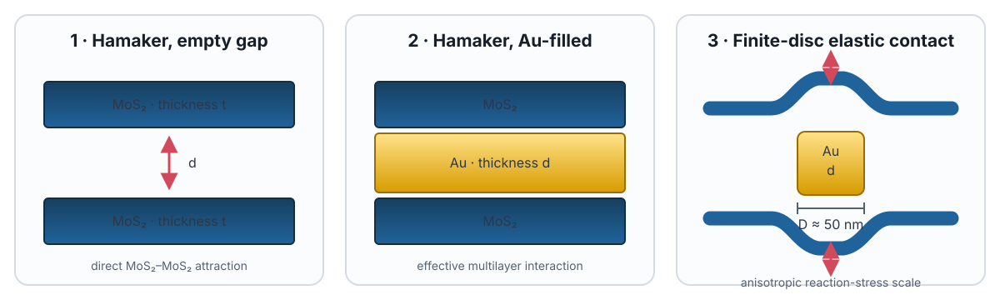

# MoS2-Au-MoS2

Research code and supporting analysis for Au confined between MoS2 flakes. The repository currently contains two complementary components:

- a reproducible continuum estimate of confinement-pressure scales for annealed Au nanodiscs; and
- an exploratory density-functional-theory workflow for constructing, rotating, relaxing, and comparing MoS2-Au structures.

## Interactive confinement-pressure explorer

[**Launch the interactive pressure explorer ->**](https://cuiyist.github.io/MoS2-Au-MoS2/)

The explorer compares three models for the experimentally relevant geometry: two approximately 50 nm thick MoS2 flakes, a 2.4-5.3 nm gap or Au thickness, and an approximately 50 nm Au-disc diameter.

1. Finite-slab Hamaker pressure across an empty gap.
2. Finite-slab Hamaker pressure with Au filling the gap.
3. Finite-disc elastic-contact reaction stress.

The Hamaker estimates are sub-MPa over the observed thickness range. The fully conformal elastic-contact model gives a GPa-scale normal reaction, which should be interpreted as an ideal-elastic upper scale rather than a uniquely determined sustained pressure. The models answer different physical questions and should not be added together.

For equations, parameter sweeps, assumptions, references, and tests, see the [confinement-pressure analysis](confinement-pressure-analysis/README.md).

## Repository layout

~~~text
.
|-- README.md
|-- confinement-pressure-analysis/
|   |-- pressure_models.py       # command-line model and CSV sweep
|   |-- test_pressure_models.py  # regression tests
|   |-- docs/index.html          # interactive explorer source
|   `-- figures/                # model schematic and preview
`-- DFT/
    |-- README.md                # DFT workflow and reproducibility notes
    |-- moire_supercell_MoS2-3DAu_30.cif
    |-- rotate.py / merge.py     # structure preparation
    |-- job.py / submit.sh       # GPAW relaxation and SLURM launcher
    `-- plot E_interfacial & E_tot.py
~~~

## Quick start: confinement-pressure analysis

The pressure model uses only the Python standard library.

~~~bash
cd confinement-pressure-analysis

# Experimental reference geometry
python3 pressure_models.py --mos2-thickness 50 --gap 2.4 --diameter 50

# Parameter sweep and regression tests
python3 pressure_models.py --sweep --output pressure_sweep.csv
python3 -m unittest -v
~~~

To view the interactive page locally:

~~~bash
python3 -m http.server 8000 --directory docs
~~~

Then open `http://localhost:8000`.

## DFT workflow

The `DFT` directory is a research snapshot built around ASE and GPAW. It includes a 296-atom reference structure (`Mo56 S112 Au128`), a vdW-DF-cx plane-wave relaxation script, structure-manipulation scripts, and an energy-fitting script.

Several scripts contain machine-specific paths or refer to source data that are not committed. Read [DFT/README.md](DFT/README.md) before running or adapting them. The historical [`DensityFunctionalTheory`](https://github.com/cuiyist/MoS2-Au-MoS2/tree/DensityFunctionalTheory) branch is retained for provenance; the fuller DFT snapshot is maintained in `DFT/` on `main`.

## Scope and reproducibility

- The continuum models provide pressure scales, not a coupled atomistic-continuum prediction of the annealing trajectory.
- The Au-filled Hamaker constant is illustrative; a full multilayer Lifshitz calculation would require frequency-dependent dielectric functions.
- The finite-disc result assumes linear elasticity and full conformal contact and is best treated as an upper stress scale.
- The DFT scripts are starting points for reproducing the original calculations. Convergence settings, input structures, paths, and computing resources should be revalidated for a new environment.

When reusing results, cite the underlying literature listed in the [analysis README](confinement-pressure-analysis/README.md#references) in addition to the associated manuscript.
